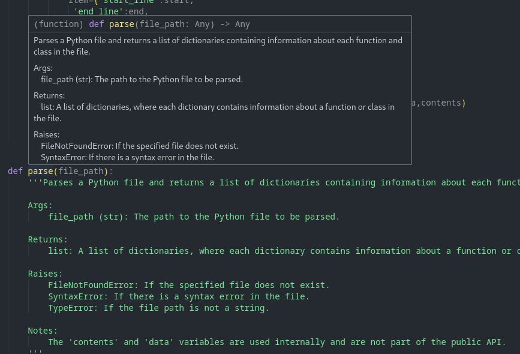

# docu-nator

A multi level engine for documenting python code with AI (LLMs) with guard rails via static analysis

## The Story Behind Docu-nator

The Docu-nator project, available on GitHub with its live documentation, was developed to leverage AI's potential in a layered approach for automated code documentation. Created as a proof of concept within two days, it demonstrates a scalable solution for various programming languages.

## Core Components

- Parser: Custom Python parser dissecting code into segments (classes, functions) with detailed mapping of elements like arguments and return types.
- Summarizer: Utilizes a local Minstrel LLM 7B model to generate accurate and complete docstrings for each code segment.
- Docstring Injection: Merges AI-generated docstrings with parser data, creating individual diffs for precise documentation updates.
- Webpage Generation: Uses Sphinx for automatic documentation generation, integrating AI-generated docstrings into a detailed web documentation format.

## Summary

Docu-nator exemplifies the seamless integration of AI into secure environments, automating the documentation process with minimal manual intervention. It stands as a testament to the power of AI in enhancing internal software development processes.

## How it works

docunator generates docstrings from the eximination of individual functions in code. The functions are sent to a llm for summarization and converted into a docstring. This docstring is then stored as a patch, which is applied by git. sphynx is then run to convert the code into documentation.

## Preq

- run the sphinx quicstart to generate the boiler plate

```bash
make quickstart
```

## how to use

```bash
# A single file
python -m docunator.main --file <python.py> --temp /temp --patch ./patch 

# A full directory and sub directories
python -m docunator.main --dir <directory> --temp /temp --patch ./patch

```

## apply the patches

- note its a git patch, so your code must be commited...

```bash
make patch
```

## VScode docstrings now show the definitions




